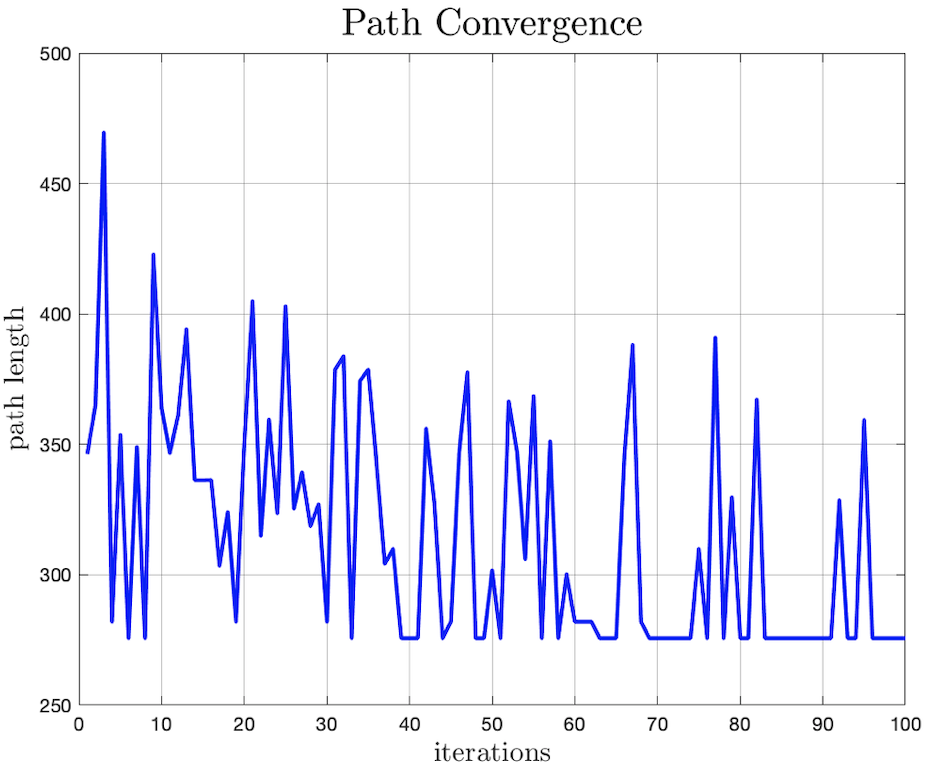
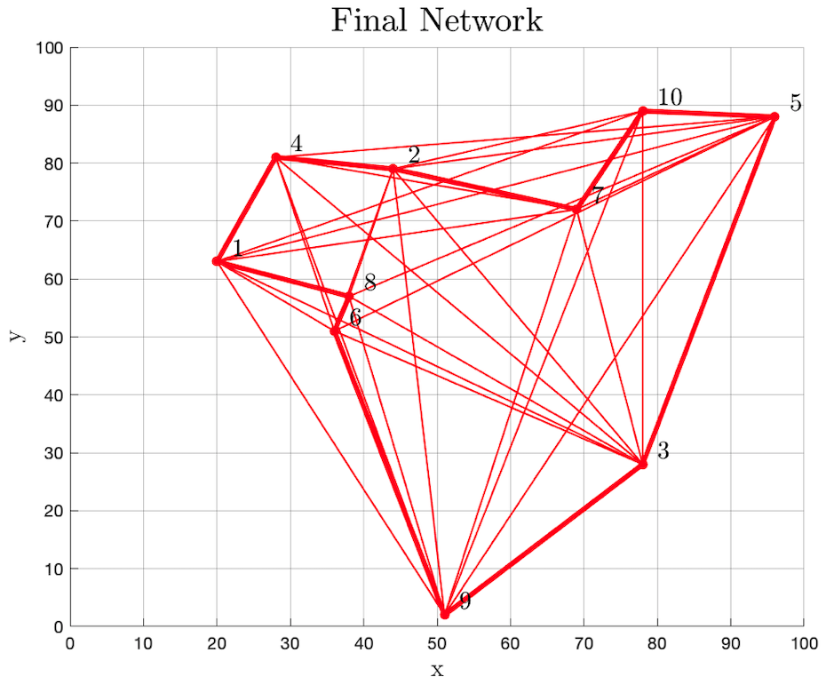
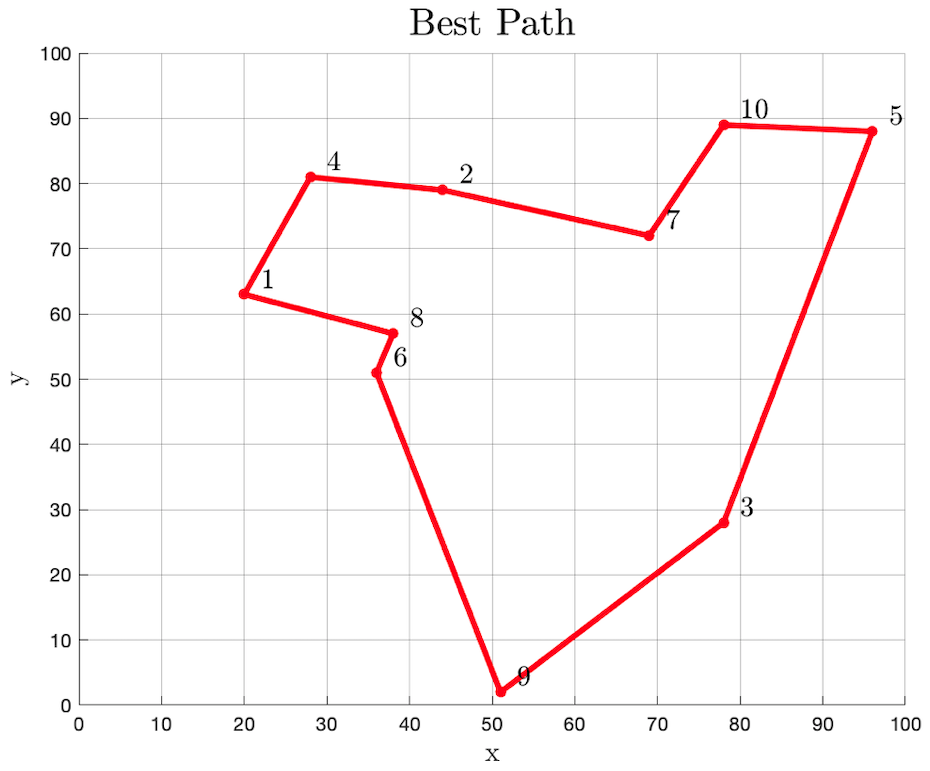

# AntColony TSP

Ant colony algorithm to solve the travelling salesman problem (TSP):

> _"Given a list of cities and the distances between each pair of cities, what is the shortest possible route that visits each city and returns to the origin city?"_ — From [Wikipedia](https://en.wikipedia.org/wiki/Travelling_salesman_problem)


## Images

<p align="center">
    
    
    
</p>

## Usage
Use the following command in the command window to run the algorithm:

```matlab
run("src/main")
```